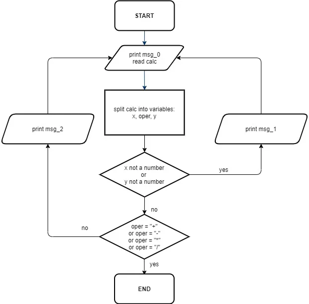
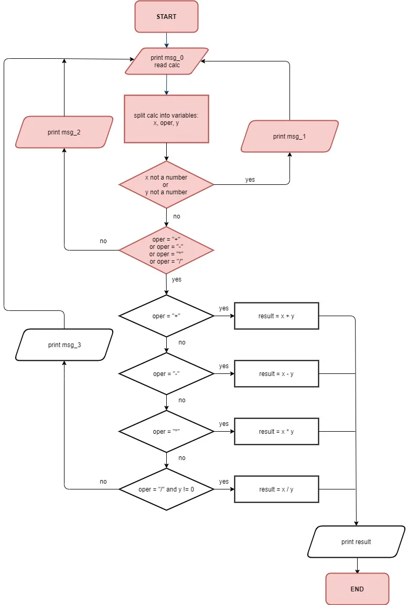

# [Honest Calculator](https://hyperskill.org/projects/350)

## About
The International Union Against Idleness (IUAI) announced a competition for an 
application that would motivate users. There are prizes involved. Since you like
competing and know a little bit about programming, you asked your friend to 
prepare an interesting algorithm for a quick buck. Unfortunately, you weren't 
clear enough, and instead of a ready-made program, a friend prepared a flowchart
of Honest Calculator. You will have to put some effort into assembling it.

Working on the project, you're at first required to build a simple calculator 
which later on is going to motivate users to try and do the math themselves by 
becoming more and more honest with them. For example, if they need to do 
calculations with multi-digit numbers, that, okay, might be tricky, so the 
calculator won't be very hard on them and just solve it. However, if the 
equation is a simple sum of two integers like 2 + 3, maybe it should suggest 
solving it themselves. Even worse, if it's multiplication by one or zero, that 
is just of the line! After all, it's a competition organized by the 
International Union Against _Idleness_.

## Learning Outcomes
Text

### Stage 1: [Data Collection](https://hyperskill.org/projects/350/stages/2056/implement)
#### _Summary_
We will start by implementing the flowchart below. Copy the messages carefully 
and assign them to the program variables. It makes no difference whether you make a list or each message is a 
separate variable. The appropriate messages must be displayed according to the flowchart.

### Stage 2: [First calculations](https://hyperskill.org/projects/350/stages/2057/implement)
#### _Summary_
Implement the new flowchart below. Use these guidelines as well:
- Don't use the built-in functions to calculate from a string
- The `result` variable must be of the `float` type
- `msg_3` should be "Yeah... division by zero. Smart move..."

